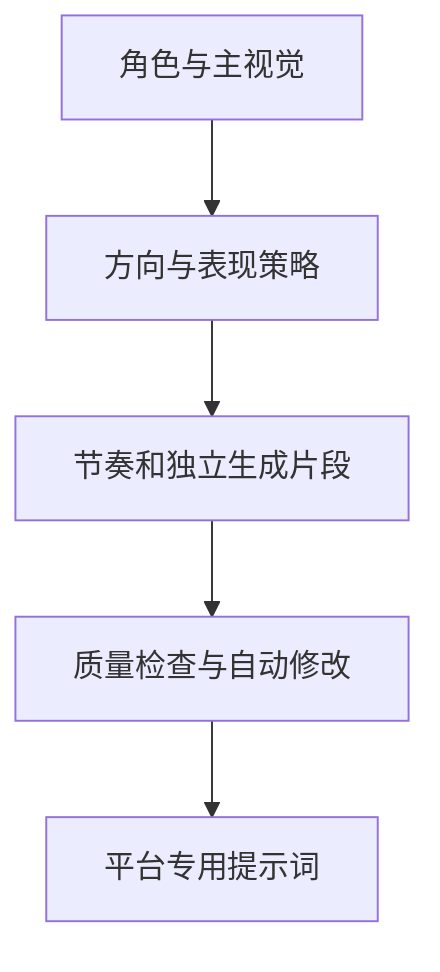

# 系统架构

## 设计目标

系统以统一导演方案为中间层，把角色设计、视频方案与具体平台格式分开。平台发生变化时，只修改适配器，不重写导演逻辑。

## 核心层次

| 层次 | 职责 | 主要位置 |
|---|---|---|
| 交互流程 | 三阶段、三次确认 | `skill/`、`workflow/` |
| 创作决策 | 选择创意方向和表现策略 | `library/creative-direction/`、`core/presentation-strategy/` |
| 统一导演方案 | 保存角色、镜头、节奏、文字、声音和素材 | `schema/director-plan.schema.yaml` |
| 导演与组件 | 规划动作、镜头、表情、转场 | `director/`、`library/` |
| 质量检查 | 检查一致性、效果、节奏和风险 | `core/quality-engine/` |
| 平台适配 | 声明平台、模式、字段和引用规则 | `platform-adapters/` |
| 质量闭环 | 评分、安全自动修改和复检 | `tools/evaluate_director_plan.py`、`tools/quality_engine.py` |
| 提示词编译 | 质量通过后转换成平台输出 | `tools/compile_platform_prompt.py` |
| 案例闭环 | 摄取、去重、标注和检索案例 | `case-library/`、`workflow/case-ingestion.md` |

## 平台编译过程

编译器先校验平台与生成方式，再读取对应适配规则，最后输出平台字段和素材提醒。

| 平台 | 支持模式 | 输出特点 |
|---|---|---|
| 即梦 | 文生、首帧、尾帧、首尾帧、多参考 | 中文分段提示词，按界面能力提醒素材引用 |
| H3 官方 | 文生、首帧、尾帧、首尾帧、多参考 | 基础模式三字段，多参考模式六字段 |
| H3 自行部署 | 文生、首帧、尾帧、首尾帧、多参考 | H3 固定字段，并输出检查点与参数占位 |

H3 自行部署以 MiniMax 官方仓库的 `h3-prompt-writing` 规范为上位规则。基础模式和多参考模式由不同检查点承载。

## 效果优先原则

质量优先级为：角色一致性 > 核心画面效果 > 动作与镜头表现 > 特效复杂度。爆发段可允许受控的二维形变，但发色、服装轮廓、武器身份和主色等固定特征不能漂移。

## 扩展方式

新增平台时，需要增加适配器配置、编译分支、示例和自动校验。不得把平台专属语法直接写入统一导演方案，也不得只新增说明文档而不提供可运行编译路径。
